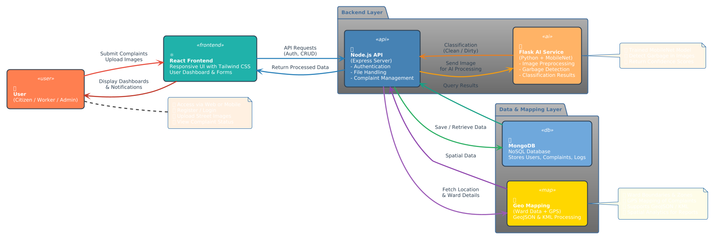

# Smart Waste Management System

**An intelligent, full-stack municipal waste management and reporting platform designed to enhance urban cleanliness through technology-driven solutions.**

## System Architecture



---

## Table of Contents

- [Overview](#overview)
- [Key Features](#key-features)
- [Technology Stack](#technology-stack)
- [Project Structure](#project-structure)
- [Installation & Setup](#installation--setup)
- [Usage Guide](#usage-guide)
- [API Documentation](#api-documentation)
- [Contributing](#contributing)
- [License](#license)
- [Contact](#contact)

---

## Overview

The Smart Waste Management System is a comprehensive digital platform that revolutionizes municipal waste management through intelligent reporting, AI-powered analysis, and geospatial tracking. This solution bridges the gap between citizens and municipal authorities, enabling efficient waste management operations and promoting cleaner urban environments.

### Core Objectives

- Streamline waste-related complaint reporting and resolution
- Leverage artificial intelligence for automated cleanliness assessment
- Provide real-time tracking and management capabilities for municipal workers
- Enable data-driven decision making through comprehensive analytics
- Foster community engagement in urban cleanliness initiatives

---

## Key Features

### 🔐 Authentication & Role Management

- Multi-tier user authentication system (Citizens, Government Employees, Municipal Workers)
- Role-based access control with tailored dashboards
- Secure session management and authorization

### 🤖 AI-Powered Analysis

- Advanced computer vision for automated street cleanliness detection
- Image classification using optimized MobileNet architecture
- Real-time analysis of uploaded waste imagery

### 📊 Complaint Management System

- Comprehensive complaint reporting workflow
- Status tracking and resolution management
- Priority-based task assignment for municipal workers

### 🗺️ Geospatial Integration

- Interactive mapping with ward-based organization
- Geolocation-based complaint plotting
- Spatial analysis for resource allocation optimization

### 📧 Communication & Notifications

- Automated email notification system
- Status update alerts for all stakeholders
- Progress tracking and reporting

### 📈 Administrative Dashboard

- Comprehensive analytics and reporting tools
- Worker performance monitoring
- Resource allocation insights

---

## Technology Stack

### Frontend

- **React.js** - Modern component-based user interface
- **Tailwind CSS** - Utility-first styling framework

### Backend Services

- **Node.js with Express.js** - Primary API server and file management
- **Python Flask** - AI model inference and machine learning operations
- **RESTful API Architecture** - Scalable service communication

### Database & Storage

- **MongoDB** - Document-based data storage
- **GridFS** - Large file storage solution

### Machine Learning

- **PyTorch** - Deep learning framework
- **MobileNet** - Efficient image classification model
- **Computer Vision** - Image processing and analysis

### Geospatial Technologies

- **GeoJSON** - Geographic data interchange
- **KML** - Keyhole Markup Language for mapping

---

## Project Structure

```
├── client/                 # React.js frontend application
│   ├── src/
│   ├── public/
│   └── package.json
├── flask-backend/          # Python Flask AI/ML service
│   ├── models/
│   ├── app.py
│   └── requirements.txt
├── server/                 # Node.js Express API server
│   ├── routes/
│   ├── models/
│   ├── middleware/
│   └── server.js
├── Map-Operation/          # Geospatial data and utilities
│   ├── geojson/
│   └── scripts/
└── docs/                   # Documentation
```

---

## Installation & Setup

### Prerequisites

- Node.js (v14.x or higher)
- Python (v3.8 or higher)
- MongoDB (v4.4 or higher)
- Git

### Quick Start Guide

1. **Clone the Repository**

   ```bash
   git clone <repository-url>
   cd smart-waste-management-system
   ```

2. **Backend Setup**

   ```bash
   # Node.js API Server
   cd server
   npm install
   cp .env.example .env  # Configure environment variables

   # Python Flask AI Service
   cd ../flask-backend
   pip install -r requirements.txt
   cp .env.example .env  # Configure AI service settings
   ```

3. **Frontend Setup**

   ```bash
   cd ../client
   npm install
   ```

4. **Database Configuration**

   - Ensure MongoDB is running locally or configure connection string
   - Update database connection settings in environment files

5. **Service Startup**

   ```bash
   # Terminal 1: Flask AI Service
   cd flask-backend
   python app.py

   # Terminal 2: Node.js API Server
   cd server
   npm start

   # Terminal 3: React Frontend
   cd client
   npm start
   ```

6. **Access the Application**
   - Frontend: `http://localhost:3000`
   - API Server: `http://localhost:5000`
   - AI Service: `http://localhost:5001`

---

## Usage Guide

### For Citizens

1. **Registration**: Create an account with valid credentials
2. **Report Issues**: Upload images and describe waste-related problems
3. **Track Progress**: Monitor complaint status and resolution updates
4. **Community Engagement**: View neighborhood cleanliness metrics

### For Municipal Workers

1. **Task Management**: Access assigned complaints and work orders
2. **Status Updates**: Report progress and completion of assigned tasks
3. **Field Operations**: Use mobile-optimized interface for on-site updates

### For Government Employees

1. **Administrative Control**: Manage user accounts and system configurations
2. **Analytics Dashboard**: Access comprehensive reports and insights
3. **Resource Planning**: Utilize data for strategic decision making

---

## API Documentation

### Authentication Endpoints

- `POST /api/auth/register` - User registration
- `POST /api/auth/login` - User authentication
- `POST /api/auth/logout` - Session termination

### Complaint Management

- `GET /api/complaints` - Retrieve complaints
- `POST /api/complaints` - Submit new complaint
- `PUT /api/complaints/:id` - Update complaint status
- `DELETE /api/complaints/:id` - Remove complaint

### AI Analysis

- `POST /api/ai/analyze` - Image classification
- `GET /api/ai/models` - Available models information

_For detailed API documentation, please refer to the `/docs/api` directory._

---

## Contributing

We welcome contributions to improve the Smart Waste Management System. Please follow these guidelines:

### Development Workflow

1. Fork the repository
2. Create a feature branch (`git checkout -b feature/enhancement-name`)
3. Commit changes with descriptive messages
4. Push to your fork and submit a pull request

### Code Standards

- Follow ESLint configurations for JavaScript/React code
- Adhere to PEP 8 standards for Python code
- Include comprehensive unit tests for new features
- Update documentation for API changes

### Issue Reporting

- Use GitHub Issues for bug reports and feature requests
- Provide detailed descriptions and reproduction steps
- Include system information and error logs when applicable

---

## License

This project is licensed under the MIT License. See the [LICENSE](LICENSE) file for detailed terms and conditions.

---

### Support & Documentation

- **Issues**: GitHub Issues Tab
- **Wiki**: Project Documentation
- **Discussions**: Community Forum

---

_Built with ❤️ for smarter, cleaner cities_
